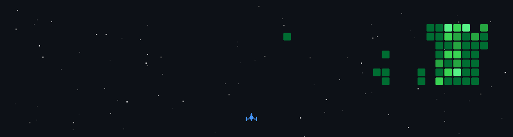

<!--

Thank you if you like this profile README!

BUT, please DO NOT copy this and create your profile based on it.

You can use it as a reference, and copy a part of it, but DO NOT copy
all of this and create your profile based on it.

It is very common that you forget to change some information and leave
mine in your profile. This has happened too many times.

And, this profile README is auto-updated by GitHub Actions, you can read
[the official documentation](https://docs.github.com/actions) to learn
how to use it.

Only when you know what you are copying should you paste it. So, again,
please DO NOT copy this and create your profile based on it.

I recommend forks, and smart-work, not blind copy-paste.

What's more, you can find other awesome profile READMEs at
https://github.com/abhisheknaiidu/awesome-github-profile-readme. There
could be a profile README that fits you better than this one.

Wish you a good-looking profile README!

                                   —— Su (https://github.com/DataBoySu)

-->
<p align="center"><a href="https://soundcloud.com/soulchefmusic/write-this-down-instrumental?in=imtorm/sets/aight&utm_source=clipboard&utm_medium=text&utm_campaign=social_sharing"></a></p>
<p align="center"><picture></picture></p>
<p align="left"><picture> </picture> </p><p align="center"><picture></picture></p>

---

<table width="100%" align="center">  
  <tr>
    <td align="left" style="border:none;padding:0;margin:0;vertical-align:top;width:40%;">
      <picture></picture></td>
    <td align="right" style="border:none;padding:0;">
      <picture></picture>
    </td>  
  </tr>
</table>

---

<details><summary> <picture></picture></summary>

<details>
  <summary><picture></picture>
</summary>
  <p align="center">
    <picture></picture>
  </p></details><details> <summary>
<picture></picture>
  </summary> <p align="center">
    <picture></picture>
  </p></details>

</details>
<p align = "center">
  
[<picture></picture>](https://raw.githubusercontent.com/DataBoySu/Resume/main/su_resume.pdf)

</p>

<p align="center"><a href="https://linkedin.com/in/anshumansingh2023"></a>
  <a href="https://bsky.app/profile/oneinrandomforest.bsky.social"></a>
  <a href="https://x.com/Void_The_Null"></a>
  <a href="https://kaggle.com/anshumansingh001"></a>
  <a href="https://www.hackerrank.com/anshumanr434"></a></p><br>

<table width="100%" style="border:none;">
  <tr>
    <td width="70%" style="vertical-align:middle;padding:0;">
      <a href="assets/Su_Stars.md">
        
      </a>
    </td>
    <td width="30%" style="vertical-align:middle;padding:0;">
      <a href="assets/Su_Stars.md">
        
      </a>
    </td>
  </tr>
</table>

---

<!-- Tech Stack -->
<details><summary>
<p align="center"><picture>
      </picture>    </p>

---

</summary>

<h3 align="center">Programming</h3>
<div align="center">
<table style="margin: 0 auto; max-width: 800px; background-color: black; color: white; border: none; border-radius: 15px; overflow: hidden;">
  <thead>
    <tr>
      <th colspan="4" align="center" style="color: white;">Languages</th>
    </tr>
  </thead>
  <tbody>
    <tr>
        <td align="center" style="border: none;">
            <picture></picture><br>Python      </td>    </tr>  </tbody></table></div><h3 align="center">AI/ML & Data Science</h3>
<div align="center">
  <table style="margin: 0 auto; max-width: 800px; background-color: black; color: white; border: none; border-radius: 15px; overflow: hidden;">
  <thead>
    <tr>
      <th align="center" colspan="4"style="color: white;">Libraries & Frameworks</th>
    </tr>  </thead>  <tbody>    <tr>      <td align="center" style="border: none;">
        <picture></picture><br>NumPy
      </td>
      <td align="center" style="border: none;">
        <picture></picture><br>Pandas
      </td>
      <td align="center" style="border: none;">
        <picture></picture><br>Keras
      </td>
      <td align="center" style="border: none;">
        <picture></picture><br>PyTorch
      </td>    </tr>    <tr>
      <td align="center" style="border: none;">
        <picture></picture><br>SkLearn      </td>      <td align="center" style="border: none;">
        <picture></picture><br>CatBoost      </td>      <td align="center" style="border: none;">
        <picture></picture><br>HF      </td>      <td align="center" style="border: none;">
        <picture></picture><br>Cupy
      </td>    </tr>  </tbody> </table></div><h3 align="center">Web Development</h3><div align="center">
<table style="margin: 0 auto; max-width: 800px; background-color: black; color: white; border: none; border-radius: 15px; overflow: hidden;">
  <thead>    <tr>
      <th colspan="8" align="center" style="color: white;">Frontend</th>
    </tr>  </thead>  <tbody>    <tr>      <td align="center" style="border: none;">
        <a href="https://nextjs.org/" style="color: white;">
          <picture></picture>
        </a>
        <br>Streamlit      </td>      <td align="center" style="border: none;">
        <a href="https://developer.mozilla.org/en-US/docs/Web/HTML" style="color: white;">
          <picture></picture>
        </a>        <br>HTML      </td>      <td align="center" style="border: none;">
        <a href="https://developer.mozilla.org/en-US/docs/Web/CSS" style="color: white;">
          <picture></picture>
        </a>        <br>CSS      </td>    </tr>  </tbody></table></div><div align="center">
<table style="margin: 0 auto; max-width: 800px; background-color: black; color: white; border: none; border-radius: 15px; overflow: hidden;">
  <thead>    <tr>      <th colspan="4" align="center" style="color: white;">Backend</th>
    </tr>  </thead>  <tbody>    <tr>      <td align="center" style="border: none;">
        <picture></picture><br>Flask
      </td>      <td align="center" style="border: none;">
        <picture></picture><br>FastAPI
      </td>    </tr>  </tbody></table></div>
<div align="center">
<table style="margin: 0 auto; max-width: 800px; background-color: black; color: white; border: none; border-radius: 15px; overflow: hidden;">
  <thead>    <tr>      <th colspan="4" align="center" style="color: white;">Database</th>
    </tr>  </thead>  <tbody>    <tr>
      <td align="center" style="border: none;">
        <picture></picture><br>MySQL
      </td>    </tr>  </tbody></table></div><h3 align="center">MLOps & DevOps</h3><div align="center">
<table style="margin: 0 auto; max-width: 800px; background-color: black; color: white; border: none; border-radius: 15px; overflow: hidden;">
  <thead>    <tr>      <th colspan="4" align="center" style="color: white;">Containerization</th>    </tr>  </thead>  <tbody>    <tr>
      <td align="center" style="border: none;">
        <picture></picture><br>Docker
      </td>    </tr>  </tbody></table></div><div align="center">
<table style="margin: 0 auto; max-width: 800px; background-color: black; color: white; border: none; border-radius: 15px; overflow: hidden;">
  <thead>    <tr>      <th colspan="3" align="center" style="color: white;">Frameworks & Tools</th>    </tr>  </thead>    <tr>      <td align="center" style="border: none;">
        <picture></picture><br>LM Studio      </td>    </tr>  </tbody></table></div></details></picture>

---

<details><summary> <picture></picture></summary>
<br>
<p align="center" width="100%">
  
  
</p>
</details>
<div align="center">
<picture>
      
    </picture>
</div>

<!-- <table width="100%" border="0" cellpadding="0" cellspacing="0" style="border:none;">
  <tr>    <td align="left">      <picture></picture>
    </td>    <td align="right" width="40%">
    <picture>
      
    </picture>
    </td> </tr></table> -->

<br>
<details><summary><picture></picture></summary><br><p align="center">
<!-- my-badges start -->
<a href="my-badges/a-commit.md"></a>
<a href="my-badges/ab-commit.md"></a>
<a href="my-badges/delorean.md"></a>
<a href="my-badges/favorite-word.md"></a>
<a href="my-badges/fix-3.md"></a>
<a href="my-badges/fix-4.md"></a>
<a href="my-badges/spooky-commit.md"></a>
<a href="my-badges/morning-commits.md"></a>
<a href="my-badges/evening-commits.md"></a>
<a href="my-badges/fix-2.md"></a>
<a href="my-badges/fix-6+.md"></a>
<a href="my-badges/mass-delete-commit.md"></a>
<a href="my-badges/stars-100.md"></a>
<a href="my-badges/stars-500.md"></a>
<a href="my-badges/stars-1000.md"></a>
<a href="my-badges/stars-2000.md"></a>
<a href="my-badges/thumbs-up-10.md"></a>
<a href="my-badges/midnight-commits.md"></a>
<!-- my-badges end -->
</details>
<br></p>

---

<details><summary>
<picture>

</picture></summary>

<!--START_SECTION:waka-->


**I'm a Night 🦉**

```text
🌞 Morning                156 commits         ███░░░░░░░░░░░░░░░░░░░░░░   10.50 %
🌆 Daytime                550 commits         █████████░░░░░░░░░░░░░░░░   37.01 %
🌃 Evening                646 commits         ███████████░░░░░░░░░░░░░░   43.47 %
🌙 Night                  134 commits         ██░░░░░░░░░░░░░░░░░░░░░░░   09.02 %
```

📊 **This Week I Spent My Time On**

```text
💬 Programming Languages:
TypeScript               1 hr 2 mins         █████████░░░░░░░░░░░░░░░░   37.67 %
Markdown                 55 mins             ████████░░░░░░░░░░░░░░░░░   33.05 %
YAML                     25 mins             ████░░░░░░░░░░░░░░░░░░░░░   15.38 %
Git                      13 mins             ██░░░░░░░░░░░░░░░░░░░░░░░   07.87 %
CSS                      4 mins              █░░░░░░░░░░░░░░░░░░░░░░░░   02.64 %
```

Last Updated on 25/01/2026 06:25:38 UTC

<!--END_SECTION:waka-->

---

</details>
<div align="center" border="0"><tr><td>
<!--START_SECTION:waka30-->

```txt
From: 25 December 2025 - To: 24 January 2026

Python       33 hrs 40 mins  🟦🟦🟦🟦🟦🟦🟦🟦🟦🔵⬛⬛⬛⬛⬛⬛⬛⬛⬛⬛⬛⬛⬛⬛⬛   37.99 %
Markdown     22 hrs          🟦🟦🟦🟦🟦🟦⬛⬛⬛⬛⬛⬛⬛⬛⬛⬛⬛⬛⬛⬛⬛⬛⬛⬛⬛   24.81 %
YAML         19 hrs 52 mins  🟦🟦🟦🟦🟦🔵⬛⬛⬛⬛⬛⬛⬛⬛⬛⬛⬛⬛⬛⬛⬛⬛⬛⬛⬛   22.41 %
Text         2 hrs 56 mins   🟦⬛⬛⬛⬛⬛⬛⬛⬛⬛⬛⬛⬛⬛⬛⬛⬛⬛⬛⬛⬛⬛⬛⬛⬛   03.32 %
TypeScript   2 hrs 10 mins   🔵⬛⬛⬛⬛⬛⬛⬛⬛⬛⬛⬛⬛⬛⬛⬛⬛⬛⬛⬛⬛⬛⬛⬛⬛   02.45 %
```

<!--END_SECTION:waka30-->
</td></tr></div>

<!--START_SECTION:shooter-->



<!--END_SECTION:shooter-->

<picture> </picture>

[](https://soundcloud.com/soulchefmusic/write-this-down-instrumental?in=imtorm/sets/aight&utm_source=clipboard&utm_medium=text&utm_campaign=social_sharing)
